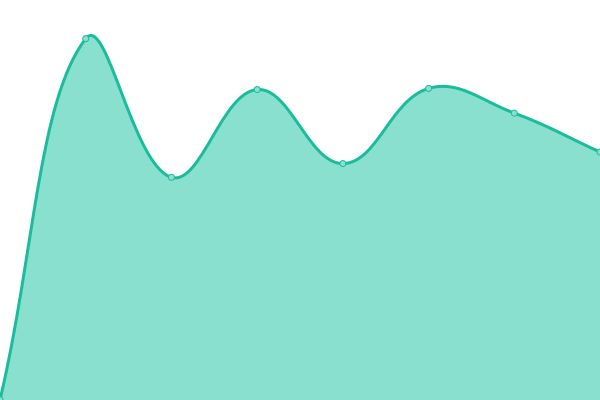
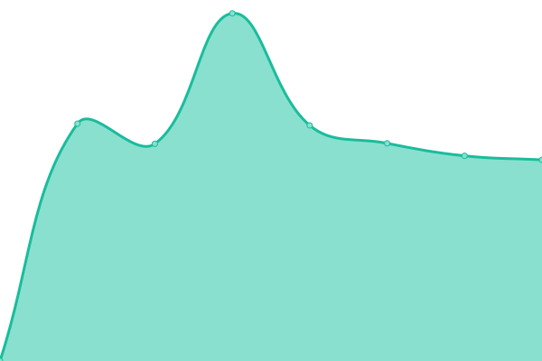
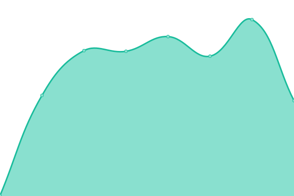

# [📈 Live Status](https://xmpl.dk): <!--live status--> **🟧 Partial outage**

This repository contains the open-source uptime monitor and status page for [Brian Schmidt Pedersen](https://xmpl.dk), powered by [Upptime](https://github.com/upptime/upptime).

With [Upptime](https://upptime.js.org), you can get your own unlimited and free uptime monitor and status page, powered entirely by a GitHub repository. We use [Issues](https://github.com/briped/upptime/issues) as incident reports, [Actions](https://github.com/briped/upptime/actions) as uptime monitors, and [Pages](https://xmpl.dk) for the status page.

<!--start: status pages-->
<!-- This summary is generated by Upptime (https://github.com/upptime/upptime) -->
<!-- Do not edit this manually, your changes will be overwritten -->
<!-- prettier-ignore -->
| URL | Status | History | Response Time | Uptime |
| --- | ------ | ------- | ------------- | ------ |
|  [IP-Support](https://ip-support.dk/) | 🟩 Up | [ip-support.yml](https://github.com/briped/upptime/commits/HEAD/history/ip-support.yml) | 

 1248ms
     
 | 

<a href="https://up.xmpl.dk/history/ip-support">100.00%</a>
    

|  [IP-Support Webmail](https://owa.ip-support.dk) | 🟩 Up | [ip-support-webmail.yml](https://github.com/briped/upptime/commits/HEAD/history/ip-support-webmail.yml) | 

 2025ms
     
 | 

<a href="https://up.xmpl.dk/history/ip-support-webmail">99.17%</a>
    

|  [IP-Support Antispam Control Panel](https://antispam.ip-support.dk) | 🟩 Up | [ip-support-antispam-control-panel.yml](https://github.com/briped/upptime/commits/HEAD/history/ip-support-antispam-control-panel.yml) | 

 1645ms
     
 | 

<a href="https://up.xmpl.dk/history/ip-support-antispam-control-panel">100.00%</a>
    

|  [Casa Anita](http://casaanita.dk) | 🟥 Down | [casa-anita.yml](https://github.com/briped/upptime/commits/HEAD/history/casa-anita.yml) | 

 441ms
     
 | 

<a href="https://up.xmpl.dk/history/casa-anita">79.74%</a>
    

<!--end: status pages-->

[**Visit our status website →**](https://xmpl.dk)

## 📄 License

- Powered by: [Upptime](https://github.com/upptime/upptime)
- Code: [MIT](./LICENSE) © [Anand Chowdhary](https://anandchowdhary.com), supported by [Pabio](https://pabio.com)
- Data in the `./history` directory: [Open Database License](https://opendatacommons.org/licenses/odbl/1-0/)
